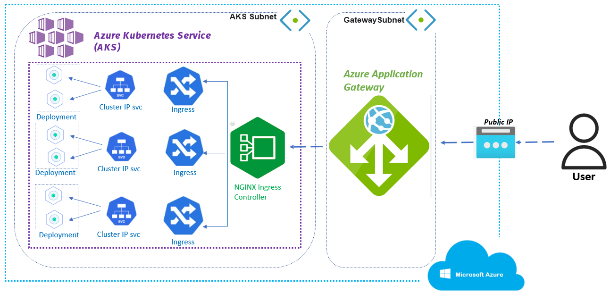
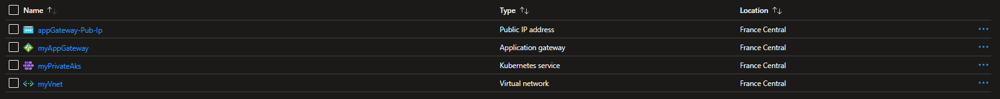
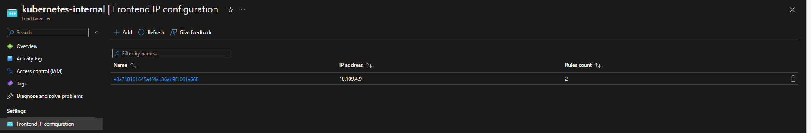
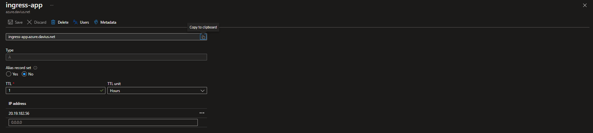
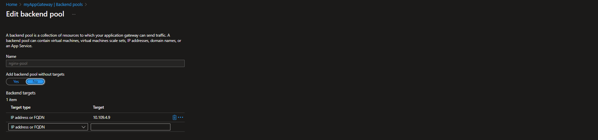
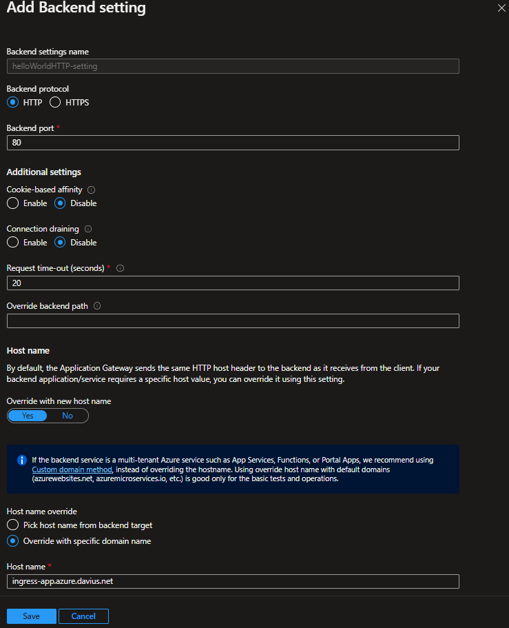
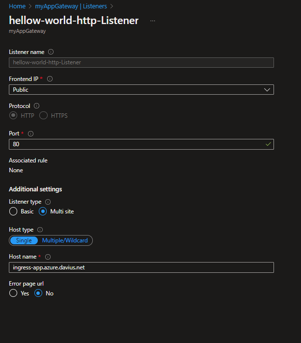
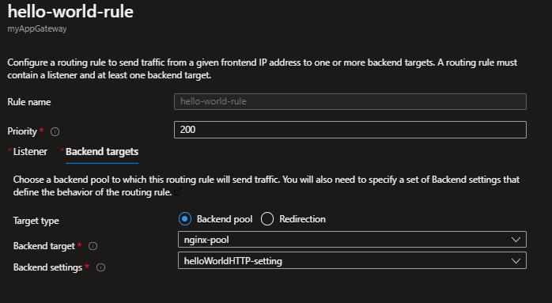

# Title : NGINX Ingress Controllers and Azure App Gateway for Azure Kubernetes Service (AKS)

[](doc-images/Diagram.PNG)

## Introduction :
To set up Ingress in K8S, you need to configure an Ingress controller. These do not come as default with the cluster and must be installed separately. An ingress controller is typically a reverse web proxy server implementation in the cluster.There are many available Ingress controllers, all of which have different features (NGINX , AGIC , Traefik, Istio Ingress ... ).
You can have multiple ingress controllers in a cluster mapped to multiple load balancers should you wish!
In this article we will learn  to deploy the NGINX ingress controller in an Azure Kubernetes Service (AKS) cluster. Two applications are then run in the AKS cluster,and we will use the application Gateway side to side to NGINX controller to expose this applications .

## Assumptions and Prerequisites :
- Basic hands-on experience with Kubernetes.
- A resource group, in this case Saif-aks-lab
- A virtual network with two subnets asg and aks. The asg subnet will hold the Application Gateway, and the aks subnet will hold the AKS cluster.
- Your AKS cluster's identity will need Network Contributor role scoped to the virtual network .
- You have configured and provisonned an azure application Gateawy and associate it to a public ip .
- You have the azure Cli installed .
- You have kubectl installed in your local machine.
- You have Helm3 installed in your local machine.

## Before starting :

- In this lab , i will use an Azure Kubernetes Service cluster , To create an Azure AKS cluster, preferably you use an Infrastructure as Code tool like Terraform.
- In this article we will use the az Cli to create a private aks cluster , the cluster use CNI and it is deployed in the a specific vnet-subnet :
```
$ az aks create --name myPrivateAks --resource-group Saif-aks-lab --node-vm-size Standard_DS2_v2 --enable-managed-identity --enable-private-cluster --kubernetes-version 1.24.9 --vnet-subnet-id "/subscriptions/xxxxxxxxxxxxxx/resourceGroups/Saif-aks-lab/providers/Microsoft.Network/virtualNetworks/myVnet/subnets/aks-subnet"
```
[](doc-images/rg-Saif-aks-lab.PNG)

- Connect to cluster using kubectl To connect to your Kubernetes cluster, use the az aks get-credentials command. Following example gets credentials for the AKS cluster named myAKSCluster in the myResourceGroup:
```
$ az aks get-credentials --resource-group Saif-aks-lab  --name myPrivateAks
```
- To verify the connection to your cluster, run the kubectl get nodes command to return a list of the cluster nodes , like i access my private clsuter from my own machine i need to use invoke command , other methods to connect to private aks cluster can be :
* Create a VM in the same Azure Virtual Network (VNet) as the AKS cluster.
* Use a VM in a separate network and set up Virtual network peering
* Use an Express Route or VPN connection.

```
$ az aks command invoke -g  Saif-aks-lab  -n myPrivateAks -c " kubectl get nodes"
  NAME                                STATUS   ROLES   AGE   VERSION
  aks-agentpool-11938646-vmss000002   Ready    agent   35m   v1.24.9
```
## Setting up Ingress with NGINX :

NGINX is a widely used Ingress controller, we will run through how to set this up with Azure Kubernetes Service.

1- Create a namespace for your ingress resources
```
$ az aks command invoke -g  Saif-aks-lab  -n myPrivateAks -c "kubectl create namespace ingress-basic"
```
2- Chose an available internal ip in the aks subnet
```
 $ az network vnet subnet list-available-ips --resource-group Saif-aks-lab --vnet-name myVNet -n aks-subnet
[
  "10.109.4.5",
  "10.109.4.6",
  "10.109.4.7",
  "10.109.4.8",
  "10.109.4.9"
]
```
I will chose the adresse ip 10.109.4.9 as a Load  balancer service external ip .

3- Use Helm to deploy an NGINX ingress controller  :
```
$ az aks command invoke -g  Saif-aks-lab  -n myPrivateAks -c " helm repo add ingress-nginx https://kubernetes.github.io/ingress-nginx &&  helm repo update &&  helm install nginx-ingress ingress-nginx/ingress-nginx  --version 4.1.3 \
  --namespace ingress-basic \
  --set controller.service.annotations."service\.beta\.kubernetes\.io/azure-load-balancer-health-probe-request-path"=/healthz \
  -f internal-ip.yaml \
  --set controller.replicaCount=2 " --file internal-ip.yaml
```
- check the ingress pod and the LB service :
```
$ az aks command invoke -g  Saif-aks-lab  -n myPrivateAks -c " kubectl get pods -n ingress-basic "
  NAME                                                    READY   STATUS    RESTARTS   AGE
  nginx-ingress-ingress-nginx-controller-8f795547-2bg5v   1/1     Running   0          3m24s
$ az aks command invoke -g  Saif-aks-lab  -n myPrivateAks -c " kubectl get svc -n ingress-basic -o wide -w nginx-ingress-ingress-nginx-controller "
  NAME                                               TYPE           CLUSTER-IP     EXTERNAL-IP   PORT(S)                      AGE
  nginx-ingress-ingress-nginx-controller             LoadBalancer   10.0.201.1     10.109.4.9    80:30776/TCP,443:30612/TCP   35s
```
> It may take a few minutes for the IP address to be assigned.
- You can check the Load balncer service created at the azure protal :

[](doc-images/LB-service.PNG)

> Browsing to this IP address will show you the NGINX 404 page. This is because we have not set up any routing rules for our services yet.

## Deploy the two test applications :
To see the ingress controller in action, run two demo applications in your AKS cluster. In this example, you use kubectl apply to deploy two instances of a simple Hello world application.
1- Deploy the first test application
```
az aks command invoke -g  Saif-aks-lab  -n myPrivateAks -c " kubectl apply -f app1.yaml" --file app1.yaml

apiVersion: apps/v1
kind: Deployment
metadata:
  name: aks-helloworld-one
  namespace: ingress-basic
spec:
  replicas: 1
  selector:
    matchLabels:
      app: aks-helloworld-one
  template:
    metadata:
      labels:
        app: aks-helloworld-one
    spec:
      containers:
      - name: aks-helloworld
        image: mcr.microsoft.com/azuredocs/aks-helloworld:v1
        ports:
        - containerPort: 80
        env:
        - name: TITLE
          value: "Welcome to Azure Kubernetes Service (AKS) 'App One' "
---
apiVersion: v1
kind: Service
metadata:
  name: aks-helloworld-one
  namespace: ingress-basic
spec:
  type: ClusterIP
  ports:
  - port: 80
  selector:
    app: aks-helloworld-one

```
2-  Now, deploy the second test application :
```
az aks command invoke -g  Saif-aks-lab  -n myPrivateAks -c " kubectl apply -f app2.yaml" --file app2.yaml

apiVersion: apps/v1
kind: Deployment
metadata:
  name: aks-helloworld-two
  namespace: ingress-basic
spec:
  replicas: 1
  selector:
    matchLabels:
      app: aks-helloworld-two
  template:
    metadata:
      labels:
        app: aks-helloworld-two
    spec:
      containers:
      - name: aks-helloworld-two
        image: mcr.microsoft.com/azuredocs/aks-helloworld:v1
        ports:
        - containerPort: 80
        env:
        - name: TITLE
          value: "Welcome to Azure Kubernetes Service (AKS) 'App Two' "
---
apiVersion: v1
kind: Service
metadata:
  name: aks-helloworld-two
  namespace: ingress-basic
spec:
  type: ClusterIP
  ports:
  - port: 80
  selector:
    app: iaks-helloworld-two

```
3- Chechk the applications pod's status:
```
$ az aks command invoke -g  Saif-aks-lab  -n myPrivateAks -c " kubectl get pods -n ingress-basic "
  NAME                                 READY   STATUS    RESTARTS   AGE
  aks-helloworld-one-cb975886-gxzr5    1/1     Running   0          15m
  aks-helloworld-two-c6769dfc7-x5wbp   1/1     Running   0          14m
```
## Setup the Ingress to route traffic between the two apps
- To route traffic to each application, create a Kubernetes ingress resource. The ingress resource configures the rules that route traffic to one of the two applications.

```
az aks command invoke -g  Saif-aks-lab  -n myPrivateAks -c " kubectl apply -f ingress.yaml" --file ingress.yaml

apiVersion: networking.k8s.io/v1
kind: Ingress
metadata:
  name: hello-world-ingress
  namespace: ingress-basic
  annotations:
    nginx.ingress.kubernetes.io/ssl-redirect: "false"
    nginx.ingress.kubernetes.io/use-regex: "true"
    nginx.ingress.kubernetes.io/rewrite-target: /$1
spec:
  ingressClassName: nginx
  defaultBackend:
    service:
      name: aks-helloworld-one
      port:
        number: 80
  rules:
  - host: hello-world-ingress.my-custom-domain
    http:
      paths:
      - backend:
          service:
            name: aks-helloworld-one
            port:
              number: 80
        path: /hello-world-one
        pathType: Prefix
      - backend:
          service:
            name: aks-helloworld-two
            port:
              number: 80
        path: /hello-world-two
        pathType: Prefix

```
- Check the ingress object by ruuning the folwing command:
```
$ az aks command invoke -g  Saif-aks-lab  -n myPrivateAks -c " kubectl get ingress -n ingress-basic "
  NAME                  CLASS   HOSTS                                  ADDRESS      PORTS   AGE
  hello-world-ingress   nginx   hello-world-ingress.my-custom-domain   10.109.4.9   80      19s
```
> Traffic to hello-world-ingress.my-custom-domain/hello-world-one is routed to the service named aks-helloworld-one. Traffic to hello-world-ingress.my-custom-domain/hello-world-two is routed to the aks-helloworld-two service. Traffic to hello-world-ingress.my-custom-domain/static is routed to the service named aks-helloworld-one for static assets.

[](doc-images/ingress-k8s.jpg)

## Configuring the Application Gateway
- For this secction , you need an azure application Gateway deployed in the same virtual network as AKS , a public adress ip is associted to the App Gateway , grab the public IP of the application gateway and create an external DNS record.
[](doc-images/DNS-record.PNG)

- Now we need to configure manually the app Gateawy to forward traffic to the NGINX ingress controller.

1- Create a Backend  pool that use the external Lb ip as a target ,In the Add a backend pool window, select Add to save the backend pool configuration and return to the Backends tab.
[](doc-images/Backend-pool.PNG)

2- Create a backend settings and override the hostname ( The Backend setting will determine the behavior of the routing rule)
[](doc-images/Backend-settings.PNG)

3- Create an HTTPS listener
[](doc-images/Listener.PNG)

4- Create a rule , you'll connect the frontend and backend pool you created using a routing rule
[](doc-images/Rules.PNG)